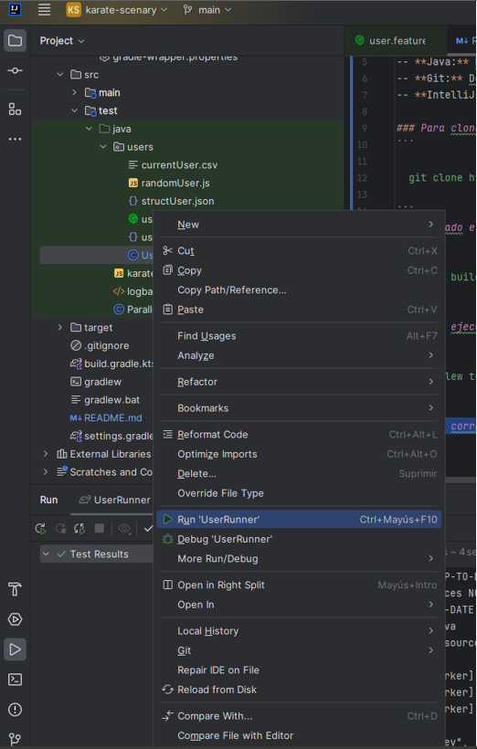
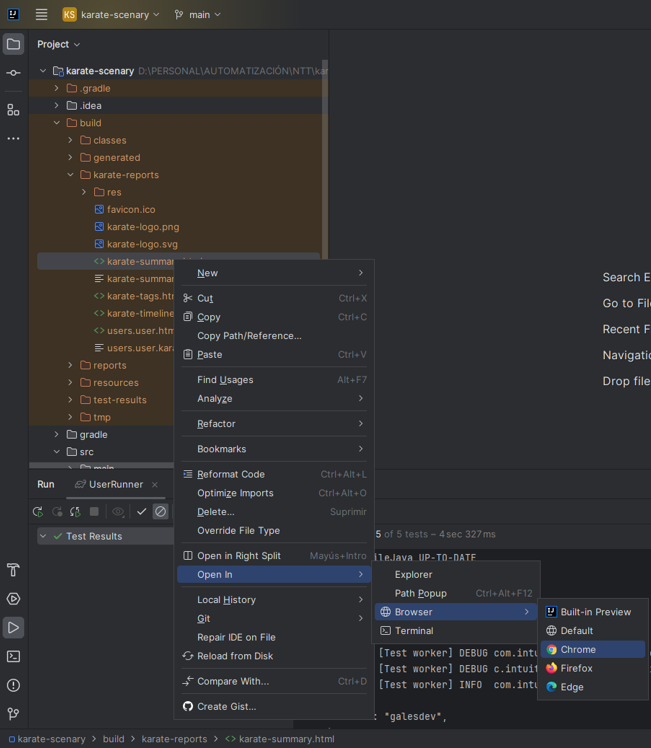
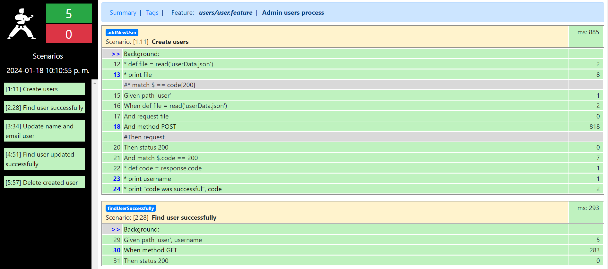

# TESTING API CON KARATE FRAMEWORK

### Para poder revisar el proyecto, tener presente los siguientes requisitos:
-- **Gradle:** La versión utilizada para el proyecto es la: 8.4  
-- **Java:** Recomendable versión del JDK 8 y configurado en las variables de entorno del sistema
-- **Git:** Debe tener instalada la herramienta de [Git](https://www.git-scm.com/downloads) para poder utilizar el bash y clonar el proyecto y verificar las versiones del mismo  
-- **IntelliJ IDEA:** Se sugiere utilizar la versión [Community Edition](https://www.jetbrains.com/es-es/idea/download/other.html)

### Para clonar el reporsitorio ejecute el siguiente comando en el bash
```

  git clone https://github.com/Guillo7799/karate-scenary.git

```
### Clonado el proyecto, ejecutar el siguiente comando en la terminal
```

  gradle build

```
### Para ejecutar las pruebas por terminal:
```

  ./gradlew test

```
### Para correr las pruebas por medio del IDE
1. Dirigirse a la carpeta karate-scenary/src/test/java/users
2. Hacer clic derecho sobre el archivo UserRunner
3. Hacer clic en Run 'UserRunner'



### Para comprobar el reporte de pruebas
1. Dirigirse a la carpeta karate-scenary/build/karate-reports
2. Hacer clic derecho sobre el archivo: karate-summary.html
3. Seleccionar con cual navegador desea ver el reporte



### Visualización de reporte:




